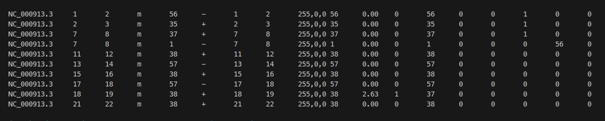

# Methylation calling using ONT methylation benchmarking dataset
In this tutorial, we will perform methylation calling using dorado on the ONT methylation benchmark sample. We will use the Escherichia coli str. K-12 substr. MG1655 sample for this analysis. E.coli exhibits 5mC methylation in CCWGG context. We will detect these 5mC methylation marks using E.coli sample from the benchmarking dataset.

## Content
- [Installation](#installation)
- [Data Access and preparation](#data-access)
- [Running methylation calling]()

## Installation
First, we have to install dorado basecaller which we will use for methylation basecalling using dorado models.
We can install dorado using following command on linux terminal : 


### Dorado

```bash
wget https://cdn.oxfordnanoportal.com/software/analysis/dorado-1.1.1-linux-x64.tar.gz
tar -xvzf dorado-1.1.1-linux-x64.tar.gz

# download dorado models

# basecalling model : 
dorado-1.1.1-linux-x64/bin/dorado download \
    --model dna_r10.4.1_e8.2_400bps_hac@v5.0.0

# modification model
dorado-1.1.1-linux-x64/bin/dorado download  \
    --model dna_r10.4.1_e8.2_400bps_hac@v5.0.0_5mC_5hmC@v3

```
If you want a more recent version of dorado/dorado models, you may refer to the Dorado Github repository.


### Samtools
Samtools can be downloaded and installed from here: https://www.htslib.org/download/


### Modkit
Modkit can be downloaded and installed from here: https://github.com/nanoporetech/modkit

## Data Access

### Download data for methylation calling using dorado
We will need to download following required data:
- Raw signal data (POD5 files)
- Reference genome file (FASTA file)

Below are the steps to download the required data : 
The following command requires you to have AWS CLI installed.

1. Create a directory to store the data
   
    ```
    mkdir ONT_meth_tutorial
    ```
3. Download sample POD5 file 
   ```
   aws s3 sync --no-sign-request s3://ont-basemod-benchmark-data/Raw/pod5/bacteria/Ecoli_WT_5kHz/ ./ONT_meth_tutorial/pod5/Ecoli_WT_5kHz/
   ```
4. Download genome fasta file 
    ```
    aws s3 cp --no-sign-request s3://ont-basemod-benchmark-data/Analysis/Reference/ecoli.fa.gz ./ONT_meth_tutorial
    ```

### Running methylation calling pipeline using dorado

#### Running Dorado
```bash
dorado-1.1.1-linux-x64/bin/dorado \
    basecaller dna_r10.4.1_e8.2_400bps_hac@v5.0.0 \
    ONT_meth_tutorial/Ecoli_WT.pod5 \
    --modified-bases-models  dna_r10.4.1_e8.2_400bps_hac@v5.0.0_5mC_5hmC@v3 --min-qscore 10 \
    --reference  ONT_meth_tutorial/ecoli.fa.gz -r > Ecoli_WT_hac_5mC_5hmC_v5r3.bam

```

#### Running samtools sort
```bash
samtools sort \
    Ecoli_WT_hac_5mC_5hmC_v5r3.bam \
    -o Ecoli_WT_hac_5mC_5hmC_v5r3_sorted.bam  \
    --write-index
```

#### Running modkit pileup
```bash
modkit pileup \
    --ref ONT_meth_tutorial/ecoli.fa.gz \
    --ignore h \
    Ecoli_WT_hac_5mC_5hmC_v5r3_sorted.bam \
    Ecoli_WT_hac_5mC_5hmC_v5r3_modkit.bed

```

Modkit pileup command returns a bedMethyl file containing genome coordinates for the cytosine locations (columns 1-3) and corresponding methylation frequencies (column 11). The first few lines of the file are shown below.



Please refer to the modkit documentation (https://github.com/nanoporetech/modkit) for more information regarding the output file.
